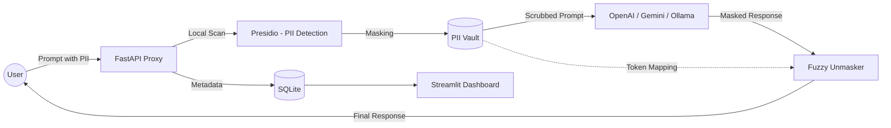

# 🛡️ Vishwa-Mask Privacy Proxy  
### Ensuring DPDP Act 2023 Compliance for Indian AI Applications 🇮🇳

Vishwa-Mask is an open-source, privacy-preserving gateway designed to sit between Indian users and Generative AI services (like OpenAI, Gemini, or Ollama).

It automatically detects and masks sensitive Indian Personal Identifiable Information (PII) before it leaves your local infrastructure — ensuring your AI integrations remain **legally compliant, secure, and privacy-first**.

---

## 🛑 The Problem

The **Digital Personal Data Protection (DPDP) Act 2023** mandates strict control over how personal data of Indian citizens is processed and transferred.

### ⚠️ Real Risks:
- **Prompt Leakage**  
  Developers unknowingly send sensitive data (Aadhaar, PAN, Phone Numbers) to cloud LLMs.

- **Compliance Violation**  
  Sending unmasked PII to third-party APIs can lead to:
  - Legal penalties  
  - Data breaches  
  - Loss of user trust  

---

## 🛡️ The Solution: Vishwa-Mask

Vishwa-Mask acts as a **Privacy Proxy Layer ("Clean Pipe")** for AI interactions.

### 🔄 Workflow:
1. Intercepts the user prompt  
2. Detects Indian PII locally  
3. Masks data using deterministic tokens  
4. Sends clean prompt to LLM  
5. Unmasks response safely  

### Example:

Rahul → [PERSON_1] <br>
9876543210 → [INDIAN_PHONE_NUMBER_1]


👉 AI never sees real sensitive data.

---

## ✨ Key Features

- 🇮🇳 India-Specific PII Recognition  
  (Aadhaar, PAN, Phone, Names)

- 🔐 Deterministic Masking Vault  
  Same entity → Same token (context preserved)

- 🔄 Reversible Unmasking  
  Full round-trip restoration of original data

- 🧠 Fuzzy Unmasking  
  Handles AI hallucinations & token distortion

- ⚡ High Performance  
  Async FastAPI architecture

- 🖥️ DPDP Audit Dashboard  
  Real-time monitoring via Streamlit

- 🧾 SQLite Logging  
  Tracks PII events without storing sensitive data

- 🏠 Local AI Support  
  Ollama integration for 100% offline privacy

- ☁️ Multi-Provider Support  
  OpenAI / Gemini / Ollama

---

## 🏗️ Architecture


## 🚀 Quick Start (Docker)

### 1️⃣ Clone Repository
```bash
git clone https://github.com/your-username/vishwa-mask-proxy.git
cd vishwa-mask-proxy
```
### 2️⃣ Setup Environment
```bash
cp .env.example .env
```
👉 Add your API keys if needed:

```env
OPENAI_API_KEY=
GEMINI_API_KEY=
OLLAMA_BASE_URL=http://localhost:11434
```

### 3️⃣ Run Project
```bash
docker compose up --build
```
## 🌐 Access

- Backend API → http://localhost:8000/docs  
- Dashboard → http://localhost:8501  

---

## 📊 Verification & Metrics

### 🔢 Compliance Index (CI)

CI = 1 - (Unmasked PII / Total PII)

👉 Achieved:

CI ≈ 1.0 (near 100% compliance)


---

## ⚡ Performance

- Latency Overhead: ~150ms  
- Async Processing Enabled  
- Background Logging Enabled  

---

## 🧪 Testing

- ✔ 5/5 Core Tests Passed  
- ✔ Deterministic Masking Verified  
- ✔ Leak Detection System Implemented  

---

## 🛠️ Tech Stack

- **Backend:** FastAPI (Python)  
- **PII Detection:** Microsoft Presidio  
- **Frontend:** Streamlit  
- **Database:** SQLite  
- **LLMs:** OpenAI / Gemini / Ollama  

---

## 🤖 AI Attribution

In accordance with FOSS Hack 2026 rules:

- Code structure and architecture were developed with assistance from AI models including ChatGPT and Gemini.  
- Indian PII recognizers and deterministic vault logic were refined through AI-assisted iteration and testing.  

---

## 📜 License

This project is licensed under the **MIT License**.

---

## ❤️ Impact

Vishwa-Mask enables:

- Indian startups to stay DPDP compliant  
- Developers to safely integrate AI APIs  
- Users to protect sensitive personal data  

👉 **Privacy by Design — not as a feature, but as a foundation.**